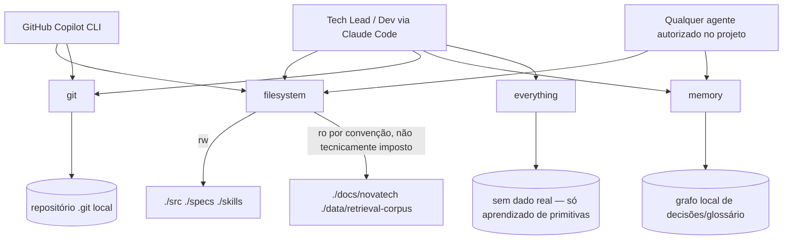

# MCP Architecture Design

**Spec**: `.specs/features/mcp-architecture/spec.md`
**Status**: Draft

---

## Architecture Overview

Os 4 servers MCP locais (`filesystem`, `git`, `memory`, `everything`) são processos de vida curta, iniciados sob demanda via `npx -y <pacote>` a partir das entradas de `.mcp/mcp.json`, e falados via stdio pelo protocolo MCP (`initialize` → `tools/list`/`resources/list` → chamadas). Não há servidor persistente, não há rede além do download inicial do pacote pelo `npx`, e não há autenticação — a única superfície de controle é (a) quais diretórios são passados como argumento ao `filesystem`, e (b) qual conjunto de servers está declarado no `.mcp/mcp.json`.



> ⚠️ Pendente de confirmação: o pacote npm do server `git` (`command`/`args` exatos) está sendo validado por execução real em paralelo entre `@cyanheads/git-mcp-server` (2.15.1, candidato de trabalho usado neste design) e `mcp-server-git` (0.0.2). Este design não trava em cima da escolha final — se o resultado do teste apontar o outro pacote, apenas a linha `git` do `.mcp/mcp.json` e o trecho de exemplo abaixo mudam; nenhuma outra seção do documento de arquitetura depende de qual pacote vence.

**Decisão de escopo já tomada nesta fase:** o server `filesystem` recebe uma única entrada em `.mcp/mcp.json` com os 5 diretórios (`./src ./specs ./skills ./docs/novatech ./data/retrieval-corpus`), na mesma forma do exemplo do Anexo C — não uma segunda entrada `filesystem-docs` separada. Motivo: investigação real do pacote (ver seção Risks & Concerns) mostrou que o modo de execução via `npx`/argumentos de linha de comando não tem uma flag nativa de somente-leitura por diretório (isso só existe no modo Docker, via `ro` no bind mount); duas entradas dariam a falsa impressão de um controle técnico que não existe. A distinção rw/ro fica documentada como convenção + gate de revisão, não como propriedade do processo.

---

## Code Reuse Analysis

### Existing Components to Leverage

| Component | Location | How to Use |
| --- | --- | --- |
| Formato de PR-como-markdown | `docs/pull-requests/PR-0001-agents-md-tech-lead.md` | Reusar a mesma estrutura (Objetivo, Mudanças, Checklist, Como revisar) quando esta feature abrir `PR-0002-mcp-architecture.md` (fase Execute, fora do escopo desta tarefa de Design) |
| Pasta `docs/runbooks/` | `docs/runbooks/` (vazia) | Destino do plano de contingência (REQ-04), feature separada dentro do mesmo spec, não coberta neste documento de Design |
| Diretórios read-only já existentes | `docs/novatech/` (5 arquivos), `data/retrieval-corpus/` | Já existem no scaffold — usados como os caminhos read-only reais no diagrama, não caminhos hipotéticos |
| Convenção de Assumptions/decisions registradas | `spec.md`, `context.md` | O pacote `git` e o formato do diagrama já vieram como decisões "Agent's Discretion"/pendentes de teste real — este design as resolve, não as reabre |

### Integration Points

| System | Integration Method |
| --- | --- |
| `.mcp/mcp.json` | Arquivo de configuração consumido diretamente pelo Claude Code / GitHub Copilot CLI ao iniciar uma sessão neste repositório; populado por um agente em paralelo a este design (ver callout acima) |
| `scripts/mcp-health-check.ts` (tarefa futura) | Vai ler este mesmo `.mcp/mcp.json` do disco — o design do documento de arquitetura já assume essa dependência na seção "Monitoramento" |
| `docs/runbooks/mcp-contingency.md` (tarefa futura) | Vai referenciar os mesmos 4 servers nomeados aqui, com sinal de detecção e comportamento degradado por server |

---

## Components

### `docs/mcp-architecture.md` (documento de arquitetura)

- **Purpose**: Tratar os 4 servers MCP como infraestrutura gerenciada — diagrama de conexões/permissões, política de aprovação, monitoramento, versionamento.
- **Location**: `docs/mcp-architecture.md`
- **Interfaces**: Documento Markdown lido por humanos (Tech Lead, time) — não é código executável.
- **Dependencies**: `.mcp/mcp.json` (fonte da verdade sobre quais servers existem — o diagrama deve espelhar exatamente as chaves de `mcpServers`); `docs/pull-requests/` (mecanismo de revisão citado na seção Versionamento).
- **Reuses**: Estrutura de seções do exercício (Anexo C, enunciado 2.2) e o formato de PR-como-markdown já usado em `PR-0001`.

### `.mcp/mcp.json` (configuração dos 4 servers)

- **Purpose**: Declarar, de forma versionada, quais servers MCP estão autorizados e com quais argumentos (escopo de diretórios para `filesystem`; repositório para `git`).
- **Location**: `.mcp/mcp.json`
- **Interfaces**: JSON com chave `mcpServers`, cada entrada `{ command, args }`, consumido pelo runtime do Claude Code / MCP client no `initialize`.
- **Dependencies**: `npx` (resolvido no ambiente; `uvx`/`uv`/`pip` indisponíveis — restrição já registrada em `context.md`).
- **Reuses**: Formato idêntico ao exemplo do Anexo C, com `uvx mcp-server-git` trocado por uma alternativa 100%-`npx` (pendente de confirmação, ver callout).

---

## Data Models (if applicable)

N/A — não há modelo de dados novo nesta feature de Design. A única estrutura relevante é o schema de `.mcp/mcp.json` em si:

```typescript
interface McpConfig {
  mcpServers: Record<string, {
    command: string;
    args: string[];
  }>;
}
```

**Relacionamento**: `scripts/mcp-health-check.ts` (tarefa futura) vai desserializar exatamente esse schema — qualquer chave adicional (`env`, `cwd`) pode ser adicionada depois sem quebrar o script, desde que ele leia por chave e não por posição.

---

## Error Handling Strategy

| Error Scenario | Handling | User Impact |
| --- | --- | --- |
| Server declarado em `.mcp/mcp.json` não responde ao handshake MCP dentro do timeout | Health check marca como DOWN e continua checando os demais (REQ-03 AC4) — comportamento definido na seção "Monitoramento" deste documento, implementação fica para a tarefa do script | Tech Lead vê status DOWN isolado, não uma falha genérica |
| `filesystem` perde acesso a `docs/novatech/` (pasta movida/renomeada/permissão de SO) | Tratado no runbook de contingência (feature irmã, fora deste documento) — mas o design já prevê que o health check deve testar essa visibilidade especificamente (REQ-03 AC3), não só "o processo subiu" | Agente avisa que a fonte está indisponível em vez de responder de memória |
| Pacote `git` escolhido não resolve via `npx` neste ambiente (falha de handshake) | Fica coberto pelo callout de pendência — a reconciliação troca a linha `git` de `.mcp/mcp.json` e o exemplo deste documento, sem reescrever as demais seções | Nenhum impacto nas seções de Política de Aprovação/Monitoramento/Versionamento, que são agnósticas ao pacote escolhido |

---

## Risks & Concerns

| Concern | Location (file:line) | Impact | Mitigation |
| --- | --- | --- | --- |
| `@modelcontextprotocol/server-filesystem` não tem flag nativa de somente-leitura por diretório quando executado via `npx`/argumentos de CLI — confirmado rodando `npx -y @modelcontextprotocol/server-filesystem --help` (o `--help` foi tratado como um diretório inválido, e a mensagem de uso real só lista `[allowed-directory] [additional-directories...]`, sem flags) e lendo o README do pacote (a flag `ro` só existe no modo de mount do Docker, não no modo `npx`) | Comportamento observado do pacote `@modelcontextprotocol/server-filesystem` (via `npx`, sem `--help` reconhecido) | Qualquer diretório passado ao processo (`./docs/novatech`, `./data/retrieval-corpus` incluídos) é tecnicamente gravável pelas tools `write_file`/`edit_file`/`move_file` do server — a separação rw/ro do enunciado não é imposta pelo processo | Documentado explicitamente como risco conhecido na seção "Diagrama de conexões" de `docs/mcp-architecture.md`; a garantia real é convenção do time + revisão de código/PR (ninguém commita uma chamada de escrita contra `docs/novatech/`), não controle técnico do server. Mitigação futura possível (fora de escopo aqui): script de health check ou hook de pre-commit que falha se um diff tocar `docs/novatech/`/`data/retrieval-corpus/` fora de um PR explicitamente aprovado para atualizar a base documental |
| Escolha do pacote `git` ainda não confirmada nesta sessão (outro agente testando em paralelo) | `.mcp/mcp.json` (entrada `git`) | Se o pacote escolhido usar um nome de `command`/`args` diferente do assumido aqui, o exemplo de configuração deste documento fica desatualizado até a reconciliação | Callout explícito no topo do documento de arquitetura; nenhuma outra seção depende do pacote exato |
| `npx -y` baixa o pacote na primeira execução — se não houver acesso de rede, todo server falha ao subir | Todas as entradas de `.mcp/mcp.json` | Health check reportaria todos os servers como DOWN na primeira execução sem cache de `npx` | Já coberto como Edge Case no `spec.md` (REQ-03) — o script deve reportar cada server DOWN individualmente, não travar; fica para a tarefa de implementação do script, não deste documento |
| `everything` não tem propósito de produção (é só aprendizado de primitivas MCP) | `.mcp/mcp.json` (entrada `everything`) | Risco baixo de escopo — alguém pode achar que é dado real | Documentado explicitamente no diagrama como "sem dado real, uso exploratório" para não gerar confusão sobre por que está na lista de infraestrutura |

---

## Tech Decisions (only non-obvious ones)

| Decision | Choice | Rationale |
| --- | --- | --- |
| Formato do diagrama de conexões | Mermaid (`graph TD`) + tabela estruturada de escopo | REQ-02 exige conteúdo (quem consome, que escopo), não uma ferramenta específica; Mermaid renderiza nativamente em GitHub/VS Code e a tabela cobre o detalhe rw/ro que o grafo sozinho não deixa claro o suficiente |
| `filesystem`: uma entrada com 5 diretórios vs. duas entradas (rw/ro) | Uma única entrada `filesystem` com todos os 5 diretórios, igual ao Anexo C | Investigação real mostrou que não há enforcement técnico de ro no modo `npx`; criar uma segunda entrada `filesystem-docs` sugeriria uma barreira técnica que não existe, e ainda quebraria REQ-01 AC1 (mínimo de 4 chaves específicas) sem ganho real de segurança |
| Pacote candidato para `git` neste documento | `@cyanheads/git-mcp-server` (2.15.1) | Mais maduro e mantido ativamente entre as duas opções 100%-`npx` levantadas em `context.md`; tratado como candidato de trabalho, não decisão final — ver callout de pendência |
| Aprovador da política de aprovação | Papel único: Tech Lead | REQ-05 AC7 proíbe explicitamente comitê/conselho; um único aprovador é o menor processo que ainda impede configuração ad-hoc |
| SLA de revisão de novo server | 1 dia útil | Concreto o suficiente para não travar um dev (REQ-05 AC9), sem abrir mão de revisão — evita o extremo "libera geral" citado como red flag na régua de nota |
| Quando rodar o health check | Manualmente antes de iniciar uma sessão de trabalho com agente; CI mencionado como evolução futura opcional, não obrigatória | `context.md` já registra que CI automatizado é uma "Deferred Idea", não requisito desta feature (REQ-01 AC3 só exige que o documento declare quando/como, não que exista workflow real) |
| O que conta como "down" vs "degradado" | DOWN = handshake MCP (`initialize`+`tools/list`) não responde dentro do timeout do script ou processo termina com erro; DEGRADADO = processo responde mas uma capacidade específica falha (ex. `filesystem` sobe mas `docs/novatech/` não está entre os diretórios acessíveis) | Operacionaliza REQ-01 AC3 com um critério verificável por execução, não uma definição vaga |

> **Project-level decisions:** Nenhum `.specs/STATE.md` existe neste repositório ainda (confirmado — arquivo não encontrado); portanto não há `AD-NNN` a que este design deva conformar ou superar. As decisões desta tabela são específicas desta feature e não criam ainda uma convenção de projeto formalizada em STATE.md — se uma feature futura precisar reaproveitar "uma entrada filesystem só, sem ro nativo" como padrão, vale promover essa linha para `AD-001` naquele momento.

---

## Open Items Carried to Execute

- Confirmar (reconciliação) o pacote/args finais de `git` em `.mcp/mcp.json` assim que a execução real em paralelo terminar, e atualizar o bloco de exemplo em `docs/mcp-architecture.md` se necessário.
- `scripts/mcp-health-check.ts`, `docs/runbooks/mcp-contingency.md` e a população real de `.mcp/mcp.json` são tarefas de Execute desta mesma feature (ou de um agente paralelo), não deste documento de Design.
