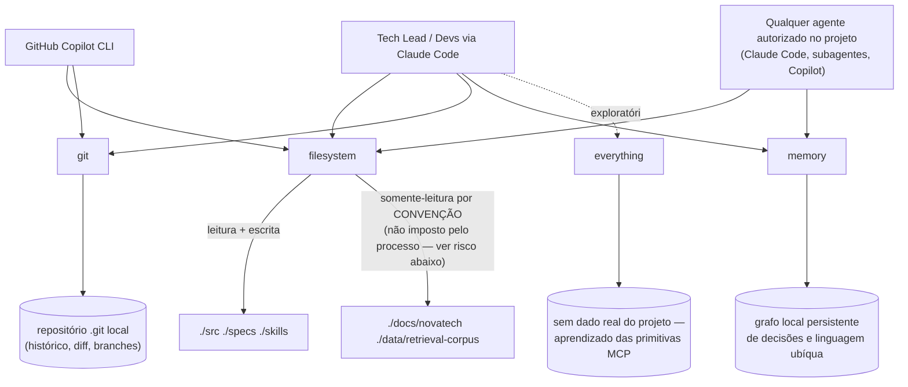

# Arquitetura de MCP — novatech-assistant

**Status**: Aceito
**Escopo**: os 4 servers MCP locais do projeto (`filesystem`, `git`, `memory`, `everything`), declarados em `.mcp/mcp.json`. Todos rodam localmente, sob demanda, via `npx -y <pacote>`, sem custo e sem dependência de serviço externo.

> ✅ **Confirmado por execução real**: entre os dois candidatos `npx`-based levantados para substituir a receita `uvx mcp-server-git` do Anexo C (indisponível neste ambiente — `uvx`/`uv`/`pip` não estão instalados), `@cyanheads/git-mcp-server` (`2.15.1`) foi validado por um handshake MCP real (`initialize` → `tools/list` via stdio), respondendo com 28 tools registradas — é o pacote usado em `.mcp/mcp.json`. O outro candidato considerado, `mcp-server-git` (npm, `0.0.2`), **não é um MCP server real**: inspeção do pacote instalado mostrou que seu `bin`/`postinstall` é `theinfosecguy/npx-canary`, uma sonda de telemetria de pesquisa de segurança que se comunica com `vulnerable-live.workers.dev` na instalação/execução (o próprio `package.json` do pacote se descreve como "security research canary — not for production use"). Este pacote **nunca deve ser adicionado** a `.mcp/mcp.json` — ver seção 2 (Política de aprovação) para por que esse achado real reforça a exigência de testar um server antes de aprová-lo, e não confiar apenas no nome/descrição do pacote no npm.

Princípio geral (enunciado do exercício): **servers MCP são infraestrutura gerenciada** — versionados, com escopo/permissões mínimas, e observáveis. O Tech Lead decide quais servers são autorizados e quais tools cada um expõe. O que se segue detalha isso para os 4 servers deste projeto.

---

## 1. Diagrama de conexões e permissões (REQ-02)



### Quem consome o quê, com qual escopo

| Server | Consumidor(es) | Escopo de acesso | rw / ro |
| --- | --- | --- | --- |
| `filesystem` | Tech Lead e Devs via Claude Code; GitHub Copilot CLI; qualquer agente autorizado no projeto | `./src`, `./specs`, `./skills` | **rw** |
| `filesystem` | (mesma entrada de server, mesmo processo — ver nota abaixo) | `./docs/novatech`, `./data/retrieval-corpus` | **ro por convenção** — ver limitação técnica abaixo |
| `git` | Tech Lead e Devs via Claude Code; GitHub Copilot CLI | Repositório local (histórico, diff, branches) — sem acesso a remoto (não há remoto/GitHub nesta fase). Sem flag `--repository`: as 28 tools do `@cyanheads/git-mcp-server` recebem `path` por chamada (default `"."`, resolvido contra o `cwd` do processo — ou seja, a raiz do repo quando o server é iniciado dali); a env var opcional `GIT_BASE_DIR` (exige path absoluto) pode restringir o escopo ainda mais, mas não é usada aqui por não ser portável entre máquinas num arquivo versionado | leitura de histórico + operações de git padrão do pacote |
| `memory` | Qualquer agente autorizado no projeto | Grafo persistente local de decisões arquiteturais e linguagem ubíqua (entidades/relações), sem escopo de diretório | rw (é o próprio propósito do server: registrar e recuperar) |
| `everything` | Tech Lead (uso exploratório) | Nenhum dado real do projeto — server de referência para aprender as primitivas do protocolo (tools/resources/prompts) | N/A — não expõe dado sensível |

### `.mcp/mcp.json` — forma esperada (referência, ver arquivo real para o estado atual)

```json
{
  "mcpServers": {
    "filesystem": {
      "command": "npx",
      "args": ["-y", "@modelcontextprotocol/server-filesystem",
               "./src", "./specs", "./skills", "./docs/novatech", "./data/retrieval-corpus"]
    },
    "git": {
      "command": "npx",
      "args": ["-y", "@cyanheads/git-mcp-server"],
      "env": { "MCP_TRANSPORT_TYPE": "stdio", "MCP_LOG_LEVEL": "info" }
    },
    "memory": {
      "command": "npx",
      "args": ["-y", "@modelcontextprotocol/server-memory"]
    },
    "everything": {
      "command": "npx",
      "args": ["-y", "@modelcontextprotocol/server-everything"]
    }
  }
}
```

O conjunto de chaves de `mcpServers` neste arquivo deve ser sempre idêntico ao conjunto de servers listados nesta seção — se um novo server for adicionado a `.mcp/mcp.json`, este diagrama entra desatualizado até ser revisado (ver seção 4, Versionamento).

### ⚠️ Limitação técnica real: `filesystem` não distingue rw/ro por diretório

Investigação executada de verdade neste ambiente, não assumida:

```
$ npx -y @modelcontextprotocol/server-filesystem --help
Warning: Cannot access directory .../--help, skipping
Error: None of the specified directories are accessible

$ npx -y @modelcontextprotocol/server-filesystem
Usage: mcp-server-filesystem [allowed-directory] [additional-directories...]
Note: Allowed directories can be provided via:
  1. Command-line arguments (shown above)
  2. MCP roots protocol (if client supports it)
At least one directory must be provided by EITHER method for the server to operate.
```

O pacote `@modelcontextprotocol/server-filesystem` **não reconhece `--help`/`--version` como flags** — trata qualquer argumento como um diretório candidato. A mensagem de uso real só aceita uma lista posicional de diretórios (`[allowed-directory] [additional-directories...]`); não existe nenhuma flag de linha de comando para marcar um diretório como somente-leitura. Confirmando pelo README do próprio pacote: a flag `ro` só existe no modo de execução via **Docker** (`--mount type=bind,...,ro`), não no modo `npx`/argumentos de CLI usado neste projeto.

**Consequência honesta**: quando o server sobe com `./docs/novatech` e `./data/retrieval-corpus` na lista de diretórios, as tools `write_file`, `edit_file`, `create_directory` e `move_file` do server funcionam ali tanto quanto em `./src`. A separação rw/ro do mapeamento do Dev 2.1 **não é um controle técnico do server** — é uma convenção do time, garantida por:

1. **Revisão de código/PR**: qualquer diff que toque `docs/novatech/` ou `data/retrieval-corpus/` fora de um PR explicitamente motivado por atualização da base documental (não por uma tarefa de código) deve ser rejeitado na revisão.
2. **AGENTS.md**: instrução prescritiva já esperada nesse documento — agentes não devem chamar `write_file`/`edit_file` contra esses caminhos, exceto quando a tarefa for explicitamente atualizar a documentação simulada da NovaTech.
3. Isso é registrado como **risco conhecido** desta arquitetura (não escondido): se um agente mal-instruído ou um prompt malicioso pedir para "corrigir um typo" em `docs/novatech/POL-001...md`, nada no processo do server impede a escrita — só a camada de revisão humana. Uma mitigação futura possível (fora do escopo desta feature) é um hook de pre-commit que falha o commit se o diff tocar esses caminhos sem uma label/flag explícita de "atualização de documentação".

---

## 2. Política de aprovação (REQ-05)

**Aprovador único**: o **Tech Lead** é o único papel responsável por aprovar a adição, remoção ou mudança de escopo de qualquer entrada em `.mcp/mcp.json`. Não há comitê ou conselho de revisão — um único aprovador é suficiente e deliberadamente mínimo, para não burocratizar a configuração local de um desenvolvedor.

**Antes do merge, quem propõe um novo server (ou mudança de escopo de um existente) DEVE declarar, no PR (ver seção 4):**

1. **Escopo**: quais diretórios (para `filesystem`-like) e/ou quais tools o server expõe — não basta nomear o pacote.
2. **Justificativa**: qual necessidade real do projeto o server resolve (ex.: "precisamos inspecionar branches locais antes de abrir o PR-como-markdown" → `git`). Um server proposto "porque pode ser útil no futuro", sem uma necessidade concreta já identificada, não é aprovado.

Um PR que adicione uma entrada a `mcpServers` sem essas duas informações declaradas não deve ser mergeado — mesmo que o server funcione tecnicamente.

**SLA de revisão**: até **1 dia útil** a partir da abertura do PR. É prazo suficiente para o Tech Lead avaliar escopo/justificativa sem travar o trabalho de um desenvolvedor que precisa da ferramenta localmente — evita os dois extremos citados como red flag: burocracia excessiva (fila de aprovação de dias) e ausência de controle ("libera geral", qualquer um adiciona qualquer server sem revisão).

**O que a revisão do Tech Lead verifica, na prática:**
- O escopo de diretórios é o mínimo necessário (least privilege) — não "dar acesso a tudo para simplificar".
- Não há sobreposição perigosa (ex.: um novo server de filesystem apontando para um diretório fora do repositório).
- O pacote é local/gratuito, consistente com a restrição já registrada (nenhum server pago ou dependente de serviço externo nesta fase — ver `context.md`).
- **O pacote foi de fato testado (handshake MCP real), não apenas lido por nome/descrição no npm.** Achado real desta feature: ao avaliar candidatos para o server `git`, o pacote `mcp-server-git` (npm, `0.0.2`) *parecia* uma opção legítima pelo nome — mas seu `postinstall`/`bin` real é `theinfosecguy/npx-canary`, uma sonda de telemetria que se comunica com um endpoint externo (`vulnerable-live.workers.dev`) na instalação/execução; não é um MCP server funcional. Isso só foi descoberto porque o pacote foi de fato instalado e inspecionado antes de entrar em `.mcp/mcp.json` — reforça que "ler a documentação do server antes de ligar" (norma já do Anexo C) inclui inspecionar o pacote instalado, não só a página do npm, e que a política de aprovação **exige evidência de teste real**, não confiança no nome do pacote.

---

## 3. Monitoramento (REQ-01 AC3)

### O que significa "down" vs. "degradado", operacionalmente

| Estado | Definição operacional |
| --- | --- |
| **UP** | O processo do server sobe e responde corretamente ao handshake MCP (`initialize` seguido de `tools/list` e/ou `resources/list`) dentro do timeout do health check. |
| **DOWN** | O processo não inicia (erro de spawn, pacote não resolvido pelo `npx`, timeout sem resposta ao handshake) — o server está indisponível por completo. |
| **DEGRADADO** | O processo sobe e responde ao handshake, mas uma capacidade específica esperada falha — o caso nomeado no exercício é o `filesystem` subir normalmente, mas `./docs/novatech` não estar entre os diretórios efetivamente acessíveis (ex.: pasta renomeada, permissão de SO revogada, ou removida da lista de argumentos por engano). Nesse caso o server não está "caído", mas uma fonte específica ficou inacessível. |

### Quando e como o monitoramento roda

- **Mecanismo**: `scripts/mcp-health-check.ts` — lê `.mcp/mcp.json` do disco, sobe cada server via seu `command`/`args`/`env`, executa uma checagem real de protocolo MCP (`initialize` + `tools/list`, não apenas verifica que o binário existe), com timeout individual por server (8s por padrão), e para `filesystem` confirma especificamente a visibilidade de `docs/novatech/` chamando a tool de listagem de diretório de verdade. Reporta uma linha de status por server (`UP`/`DOWN`/`DEGRADED`) e encerra com código de saída não-zero se qualquer server não estiver `UP`.
- **Quando rodar**: **manualmente, antes de iniciar uma sessão de trabalho com agente** (Claude Code ou Copilot CLI) — é o gate mínimo para saber, antes de pedir a um agente para consultar `docs/novatech/` ou o histórico do `git`, que os servers realmente respondem. Comando: `npm run mcp:health` (equivalente a `npx tsx scripts/mcp-health-check.ts`).
- **CI**: rodar o health check automaticamente em pipeline é uma evolução futura desejável, não um requisito desta feature — fica registrado aqui como opção, não como obrigação, para não inflar escopo sem necessidade comprovada.
- **Evidência de execução real**: duas execuções reais estão capturadas no repositório —
  - `scripts/output/run-output-normal.txt`: os 4 servers `UP`.
  - `scripts/output/run-output-degraded.txt`: `docs/novatech` removido temporariamente da lista de diretórios do `filesystem` (simulação real do cenário nomeado no exercício), script rodado contra o `.mcp.json` real, `filesystem` reportado `DEGRADED` com a causa exata, `.mcp.json` restaurado depois. Ver `docs/runbooks/mcp-contingency.md` para o que o agente deve fazer em cada um desses estados, por server.

---

## 4. Versionamento (REQ-01 AC2)

**Arquivo versionado**: `.mcp/mcp.json`, commitado no Git como qualquer outro arquivo de configuração do repositório — não é um arquivo local ignorado (`.gitignore`), justamente para que toda mudança de escopo passe por revisão, não seja um estado local de máquina de um único desenvolvedor.

**Mecanismo concreto de revisão de mudança**: toda alteração em `.mcp/mcp.json` (novo server, mudança de diretório de escopo, mudança de argumentos) é proposta como uma branch + um PR-como-markdown, seguindo a convenção já em uso neste projeto em `docs/pull-requests/` (ver `docs/pull-requests/PR-0001-agents-md-tech-lead.md` como referência de formato: Objetivo, Mudanças, Checklist de validation gates, Como revisar). O PR deve:

1. Incluir o **diff literal** de `.mcp/mcp.json` na seção de Mudanças — a revisão do Tech Lead (seção 2 acima) é sobre esse diff, linha por linha, não sobre uma descrição em prosa da intenção.
2. Rodar o health check (seção 3) antes de marcar o PR como pronto para revisão, e anexar a saída — uma mudança de escopo que quebra um server (ex.: um `git` mal configurado) deve aparecer como DOWN antes do merge, não depois.
3. Ser aprovado pelo Tech Lead dentro do SLA de 1 dia útil (seção 2) antes do merge na branch de destino.

Uma frase genérica como "versionamos no Git" não é suficiente — o mecanismo aqui é especificamente **review de diff em PR local**, com o health check como gate de validação anexado, replicando o mesmo padrão de PR-como-markdown já usado por esta feature-irmã (`agents-md-tech-lead`) neste mesmo repositório.

---

## Referências

- `.specs/features/mcp-architecture/spec.md` — requisitos (REQ-01..REQ-05) e critérios de aceite desta feature.
- `.specs/features/mcp-architecture/context.md` — decisões e restrições de ambiente (ausência de `uvx`/`uv`/`pip`, precedente de tooling Copilot CLI → subagente).
- `.specs/features/mcp-architecture/design.md` — raciocínio de design por trás deste documento (trade-offs, riscos, decisões técnicas).
- `docs/cenario-2/anexo-c-estrutura-repositorio.md` — formato de referência de `.mcp/mcp.json` e mapeamento necessidade → server.
- `docs/pull-requests/PR-0001-agents-md-tech-lead.md` — formato de referência de PR-como-markdown citado na seção Versionamento.
- `docs/runbooks/mcp-contingency.md` — plano de contingência detalhado por server quando um deles fica indisponível, escrito a partir da evidência real de `scripts/output/`.
- `scripts/mcp-health-check.ts` e `scripts/output/run-output-{normal,degraded}.txt` — implementação e evidência real do health check citado na seção 3.
